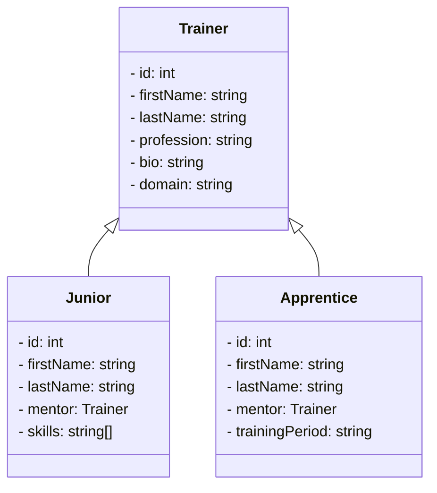

## Doctrine Entity Inheritance Mapping

### 1. Mapped Superclasses
- Une `mapped superclass` est une classe (abstraite ou concrète) fournissant un état persistant et des informations de mapping pour ses sous-classes, mais n'est pas une entité en soi.
- Utilisée pour définir des états et des mappings communs à plusieurs classes d'entités.
- Aucune table n'est créée pour une `mapped superclass`, seulement pour les classes d'entités héritées.

#### Exemple :
```php
use Doctrine\ORM\Mapping as ORM;

#[ORM\MappedSuperclass]
class Person {
    #[ORM\Column(type: 'integer')]
    protected int $mapped1;
    #[ORM\Column(type: 'string')]
    protected string $mapped2;
    #[ORM\OneToOne(targetEntity: Toothbrush::class)]
    #[ORM\JoinColumn(name: 'toothbrush_id', referencedColumnName: 'id')]
    protected ?Toothbrush $toothbrush = null;
}

#[ORM\Entity]
class Employee extends Person {
    #[ORM\Id, ORM\Column(type: 'integer')]
    private ?int $id = null;
    #[ORM\Column(type: 'string')]
    private string $name;
}

#[ORM\Entity]
class Toothbrush {
    #[ORM\Id, ORM\Column(type: 'integer')]
    private ?int $id = null;
}
```

### 2. Entity Inheritance
- Lorsque qu'une classe d'entité hérite d'une autre classe d'entité, une hiérarchie d'héritage se forme.
- La classe racine utilise les annotations `#[InheritanceType]`, `#[DiscriminatorColumn]` et `#[DiscriminatorMap]`.

### 3. Single Table Inheritance (STI)
- Toutes les classes d'une hiérarchie sont mappées à une seule table.
- Avantages : Performances élevées pour les requêtes.
- Considérations : Colonnes inutilisées dans la table pour les sous-types.

#### Exemple :
```php
use Doctrine\ORM\Mapping as ORM;

#[ORM\Entity]
#[ORM\InheritanceType('SINGLE_TABLE')]
#[ORM\DiscriminatorColumn(name: 'discr', type: 'string')]
#[ORM\DiscriminatorMap(['person' => Person::class, 'employee' => Employee::class])]
class Person {
    #[ORM\Column(type: 'string')]
    private string $name;
}

#[ORM\Entity]
class Employee extends Person {
    #[ORM\Column(type: 'integer')]
    private int $salary;
}
```

### 4. Class Table Inheritance (CTI)
- Chaque classe de la hiérarchie est mappée à plusieurs tables : sa propre table et les tables de toutes les classes parentes.
- Avantages : Flexibilité de conception.
- Considérations : Requêtes impliquant des jointures multiples, impact sur les performances.

#### Exemple :
```php
use Doctrine\ORM\Mapping as ORM;

#[ORM\Entity]
#[ORM\InheritanceType('JOINED')]
#[ORM\DiscriminatorColumn(name: 'discr', type: 'string')]
#[ORM\DiscriminatorMap(['person' => Person::class, 'employee' => Employee::class])]
class Person {
    #[ORM\Column(type: 'string')]
    private string $name;
}

#[ORM\Entity]
class Employee extends Person {
    #[ORM\Column(type: 'integer')]
    private int $salary;
}
```

### 5. Overrides
- `AssociationOverride` : Surcharge un mappage de relation défini dans une `mapped superclass`.
- `AttributeOverride` : Surcharge le mappage d'un champ défini dans une `mapped superclass`.

#### Exemple d'Association Override :
```php
use Doctrine\ORM\Mapping as ORM;

#[ORM\MappedSuperclass]
class User {
    #[ORM\ManyToMany(targetEntity: 'Group', inversedBy: 'users')]
    #[ORM\JoinTable(name: 'users_groups')]
    protected Collection $groups;
}

#[ORM\Entity]
#[ORM\AssociationOverrides([
    new ORM\AssociationOverride(
        name: 'groups',
        joinTable: new ORM\JoinTable(
            name: 'users_admingroups',
            joinColumns: [new ORM\JoinColumn(name: 'adminuser_id')],
            inverseJoinColumns: [new ORM\JoinColumn(name: 'admingroup_id')]
        )
    )
])]
class Admin extends User {}
```

#### Exemple d'Attribute Override :
```php
use Doctrine\ORM\Mapping as ORM;

#[ORM\MappedSuperclass]
class User {
    #[ORM\Id, ORM\GeneratedValue, ORM\Column(type: 'integer', name: 'user_id', length: 150)]
    protected ?int $id = null;
    #[ORM\Column(name: 'user_name', nullable: true, unique: false, length: 250)]
    protected string $name;
}

#[ORM\Entity]
#[ORM\AttributeOverrides([
    new ORM\AttributeOverride(
        name: 'id',
        column: new ORM\Column(
            name: 'guest_id',
            type: 'integer',
            length: 140
        )
    ),
    new ORM\AttributeOverride(
        name: 'name',
        column: new ORM\Column(
            name: 'guest_name',
            nullable: false,
            unique: true,
            length: 240
        )
    )
])]
class Guest extends User {}
```

### 6. Querying the Type
Doctrine permet d'interroger des types d'entités spécifiques avec le construct `INSTANCE OF`.

#### Exemple :
```php
$query = $em->createQuery("SELECT staff FROM MyProject\Model\Staff staff WHERE staff NOT INSTANCE OF MyProject\Model\Technician");
$staffs = $query->getResult();
```

## Stratégie pour l'héritage

### Meilleures Stratégies pour l'Héritage d'Entités dans Doctrine

1. **Single Table Inheritance (STI)**
   - **Description** : Toutes les classes d'une hiérarchie d'héritage sont mappées à une seule table de base de données.
   - **Avantages** :
     - Performances élevées pour les requêtes, car aucune jointure de table n'est nécessaire.
     - Simplicité de conception et de maintenance pour les hiérarchies simples.
   - **Inconvénients** :
     - Les colonnes inutilisées peuvent apparaître dans la table, entraînant une certaine inefficacité de stockage.
   - **Utilisation Recommandée** : Hiérarchies simples et stables où les performances de requêtes sont cruciales.

   #### Exemple :
   ```php
   use Doctrine\ORM\Mapping as ORM;

   #[ORM\Entity]
   #[ORM\InheritanceType('SINGLE_TABLE')]
   #[ORM\DiscriminatorColumn(name: 'discr', type: 'string')]
   #[ORM\DiscriminatorMap(['person' => Person::class, 'employee' => Employee::class])]
   class Person {
       #[ORM\Column(type: 'string')]
       private string $name;
   }

   #[ORM\Entity]
   class Employee extends Person {
       #[ORM\Column(type: 'integer')]
       private int $salary;
   }
   ```

2. **Class Table Inheritance (CTI)**
   - **Description** : Chaque classe de la hiérarchie est mappée à sa propre table ainsi qu'aux tables de toutes les classes parentes.
   - **Avantages** :
     - Flexibilité de conception : chaque sous-classe peut avoir sa propre table.
     - Améliore l'organisation et la maintenance des données dans des hiérarchies complexes.
   - **Inconvénients** :
     - Performances réduites en raison des jointures multiples nécessaires pour les requêtes.
   - **Utilisation Recommandée** : Hiérarchies complexes avec de nombreux niveaux et besoins de personnalisation spécifiques.

   #### Exemple :
   ```php
   use Doctrine\ORM\Mapping as ORM;

   #[ORM\Entity]
   #[ORM\InheritanceType('JOINED')]
   #[ORM\DiscriminatorColumn(name: 'discr', type: 'string')]
   #[ORM\DiscriminatorMap(['person' => Person::class, 'employee' => Employee::class])]
   class Person {
       #[ORM\Column(type: 'string')]
       private string $name;
   }

   #[ORM\Entity]
   class Employee extends Person {
       #[ORM\Column(type: 'integer')]
       private int $salary;
   }
   ```

3. **Mapped Superclass**
   - **Description** : Classe abstraite ou concrète fournissant un état persistant et des informations de mappage pour ses sous-classes, mais n'étant pas elle-même une entité.
   - **Avantages** :
     - Permet de partager des propriétés et des mappings communs sans créer de table pour la classe de base.
     - Facilite la réutilisation du code et la maintenance.
   - **Inconvénients** :
     - Ne peut pas être requêtée directement.
   - **Utilisation Recommandée** : Lorsque plusieurs entités partagent des propriétés communes mais n'ont pas besoin d'être traitées comme une seule entité.

   #### Exemple :
   ```php
   use Doctrine\ORM\Mapping as ORM;

   #[ORM\MappedSuperclass]
   class Person {
       #[ORM\Column(type: 'integer')]
       protected int $mapped1;
       #[ORM\Column(type: 'string')]
       protected string $mapped2;
   }

   #[ORM\Entity]
   class Employee extends Person {
       #[ORM\Id, ORM\Column(type: 'integer')]
       private ?int $id = null;
       #[ORM\Column(type: 'string')]
       private string $name;
   }
   ```

### Conclusion

- **STI** est idéal pour les hiérarchies simples avec des performances de requête optimisées.
- **CTI** offre une flexibilité de conception pour les hiérarchies complexes mais peut avoir un impact sur les performances.
- **Mapped Superclass** est utile pour partager des propriétés communes sans requêtes directes.


## Exemples pratiques 



- L'entité Trainer 

```php
<?php

namespace App\Entity;

use App\Repository\TrainerRepository;
use Doctrine\Common\Collections\ArrayCollection;
use Doctrine\Common\Collections\Collection;
use Doctrine\DBAL\Types\Types;
use Doctrine\ORM\Mapping as ORM;
use Symfony\Component\Validator\Constraints as Assert;

#[ORM\InheritanceType('SINGLE_TABLE')]
#[ORM\DiscriminatorColumn(name: 'discr', type: 'string')]
#[ORM\DiscriminatorMap([
    'trainer' => Trainer::class,
    'junior' => Junior::class, 
    'apprentice' => Apprentice::class])]
#[ORM\Entity(repositoryClass: TrainerRepository::class)]
class Trainer
{
    #[ORM\Id]
    #[ORM\GeneratedValue]
    #[ORM\Column]
    private ?int $id = null;

    // ...
}
```

- Entité Apprentice

```php
<?php

namespace App\Entity;

use App\Repository\ApprenticeRepository;
use Doctrine\ORM\Mapping as ORM;

use App\Enum\Domain as Domain;

#[ORM\Entity(repositoryClass: ApprenticeRepository::class)]
class Apprentice extends Trainer
{

    #[ORM\Column(type: 'string', enumType: Domain::class, nullable:true)]
    private ?Domain $domain = null;

    // ...
}
```

- Entité Junior
```php
<?php

namespace App\Entity;

use App\Repository\JuniorRepository;
use Doctrine\ORM\Mapping as ORM;

#[ORM\Entity(repositoryClass: JuniorRepository::class)]
class Junior extends Trainer
{

    #[ORM\Column(length: 255, nullable:true)]
    private ?string $grade = null;

    #[ORM\Column(nullable: true)]
    private ?float $age = null;

    // ...
}
```