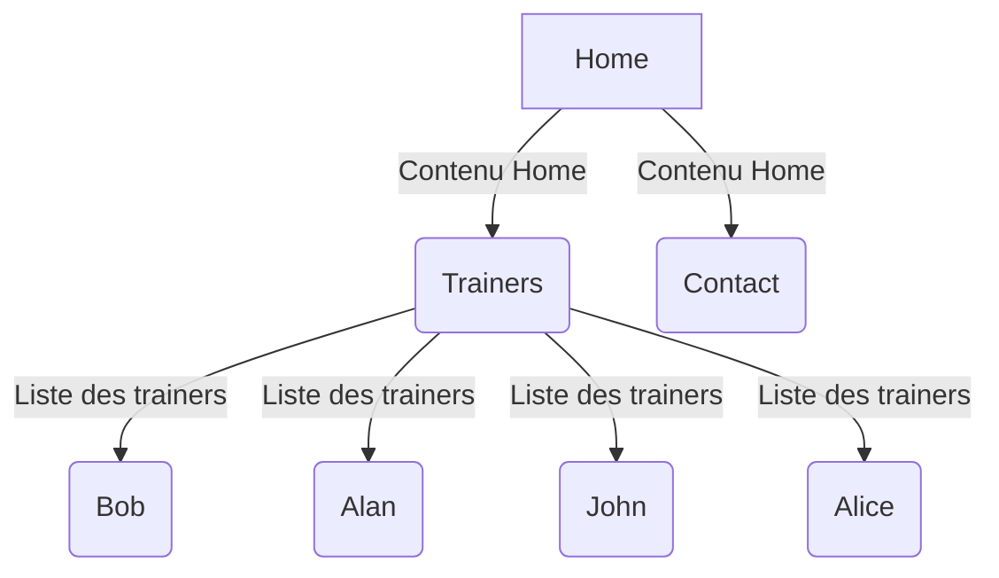

# Projet Dev Trainer - partie 1 

## Trainer - sans base de données

Dans un nouveau projet dev-trainer, vous allez créer la home page.

1. Réinstallez un projet SF trainer sur votre machine avec la configuration que nous avons faite dans le cours.

1. Introduction au projet fil rouge.  

Vous allez réaliser une page princiaple sur deux colonnes, **Bootstrap**, aidez vous des wireframe ci-après.

Bien sûr vous allez utiliser Twig pour réaliser chacune des intégrations. Aidez-vous de la documentation officiel.

On ne vous demande pas de faire un maquettage graphique du projet, utilisez les wireframes ci-dessous et surtout un Framework CSS pour intégrer les pages (Bootstrap CSS conseillé).

1. Dans le cas où vous voulez changer de Framework CSS voyez la documentation en ligne : [assetmapper](https://symfony.com/doc/current/frontend/asset_mapper.html)

2. Nous allons construire l'arborescence suivante.



- Intégrez la page ci-dessus ( simplement en CSS)

🚧 

1. Créez le controller Home (fournit)
1. Créez le controller Contact (fournit)

### Détails des différentes pages à réaliser - pour l'instant uniquement la page home

1. Home (page d'accueil) : Elle répertoriera les derniers feedbacks rédigés par les formateurs, des cours réalisés. L'aspect fonctionnel de cette page sera mis en œuvre ultérieurement lors de la création de la base de données.

Utilisez les informations dans le dataset suivant : 
[dataset](./Data/trainers.php) pour afficher les données en page d'accueil.

Les pages suivantes sont statiques pour l'instant.

2. Trainers : elle présentera la liste des formateurs ainsi que leurs compétences à réaliser.
3. Trainer : elle affiche un trainer.

4. Contact : elle fournira des informations sur la manière de contacter la société.

### Wireframe

1. home page


Vous pouvez vous aider de cette page pour réaliser l'intégration CSS : [home page](../Corrections/Models-pages/index.html)


## Indications

Dans le contrôleur HomeController créer une méthode privée data comme suit pour traiter les données dans la méthode index pour la page d'accueil.

Attentions pour afficher les derniers articles dans la colonne de droite il faudra penser à faire une boucle dans une boucle.

```php
// Dans le controller HomeController 
// ...
  private function data(): array
      {

          return [
              "trainers" => [
                  [
                      "firstName" => "Antoine",
                      "lastName" => "L",
                      "profession" => "Professor Symfony",
                      "bio" => "Antoine L is a certified Symfony coach with over 10 years of experience.",
                      "articles" => [
                          [
                              "title" => "The Benefits of Morning Exercise",
                              "date" => "Nov 11",
                              "content" => "Exercising in the morning can boost your metabolism and energy levels throughout the day."
                          ],
                          [
                              "title" => "Healthy Eating Tips",
                              "date" => "Nov 10",
                              "content" => "Eating a balanced diet is crucial for maintaining good health and fitness."
                          ]
                      ]
                  ],
                  [
                      "firstName" => "Aurélien",
                      "lastName" => "S",
                      "profession" => "Professor React",
                      "bio" => "Aurélien has been teaching yoga for over 8 years and specializes in Vinyasa and Hatha yoga.",
                      "articles" => [
                          [
                              "title" => "The Power of Meditation",
                              "date" => "Nov 12",
                              "content" => "Meditation can help reduce stress and improve overall well-being."
                          ],
                          [
                              "title" => "Yoga for Beginners",
                              "date" => "Nov 5",
                              "content" => "Starting a yoga practice can be intimidating, but with these tips, you can get started with confidence."
                          ]
                      ]
                  ]
              ]
          ];
      }
  ```
