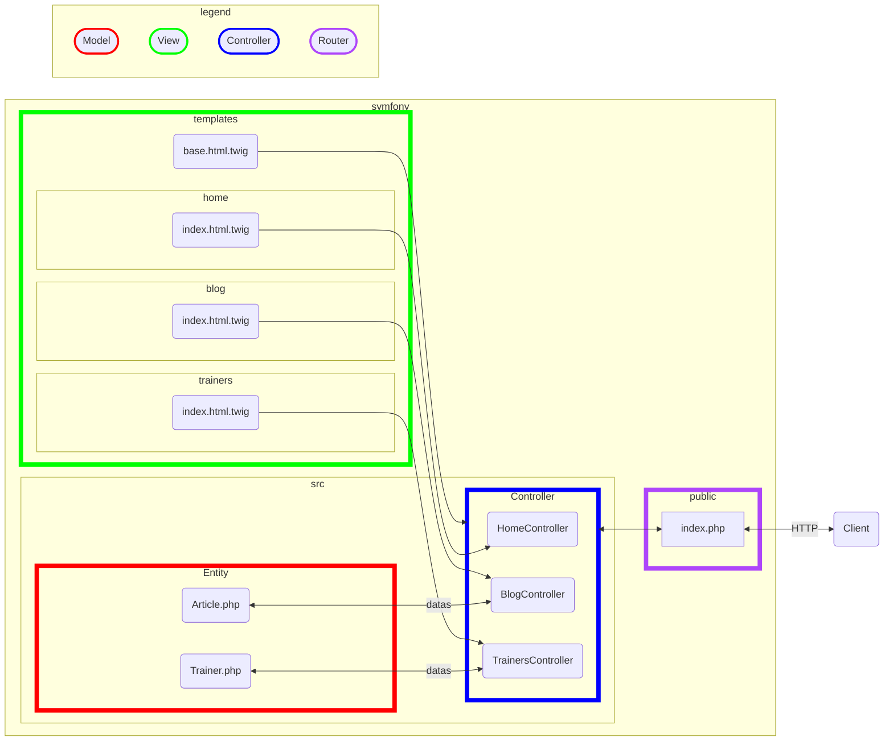

# Installation

⛅ Cours Symfony 

La documentation [symfony](https://symfony.com/doc/current/index.html)

Des vidéos importantes [symfonycasts](https://symfonycasts.com/)

Pour utiliser Symfony il faut :

-  PHP au moins 8.1 intl, pdo_mysql, xsl, amqp, gd, openssl, sodium ou plus & les extensions suivantes :
 curl et zip.

 *Dans votre configuration MAMP ou WAMP, cela devrait être le cas.*

Ouvrez un terminal et tapez la ligne de commande suivante pour voir les extensions de votre PHP :

```bash
php -m
```

- De manière optionelle vous pouvez installer la CLI de Symfony :

*Remarques : une CLI ou Command Line Interface, est une suite de programmes exécutables en ligne de commandes, écrit en PHP et permettant de créer des controller, model, view. Elle permet également le testing et le déploiement de l'application.*

- Pour Mac

```bash
curl -sS https://get.symfony.com/cli/installer | bash
```
Une fois la CLI de Symfony installée vous pouvez y accéder de manière gloable :

```bash
mv /Users/votre_nom_de_machine/.symfony/bin/symfony /usr/local/bin/symfony
```

*Voir sur cette page les autres options selon votre OS.*

[Dowload Symfony](https://symfony.com/download)

- Pour Windows utilisez scoop

```bash
scoop install symfony-cli
```

- Il faut également le gestionnaire de package PHP **composer**, voir l'installation directement sur le site de composer (rien de compliqué).

Composer doit-être installé et à jour.

- Mise à jour de composer

```bash
# mise à jour de composer
composer self-update
```

- Installation du projet 

Vous pouvez soit installer Symfony soit en microservice, soit en full.

Microservice est très adapté par exemple pour la création d'API (Application programming Interface).

Full correspond à une installation pour les Web App "traditionnelle".

Pour **découvrir Symfony**, nous allons faire les deux installations : **microservice** et **full**.

Vérifiez avant de continuer que votre système est correctement configuré avec la CLI de SF :


```bash
symfony check:requirements
```

## Installation 

Sur votre bureau dans un dossier **dev-trainer** tapez dans la console la ligne de commande suivante :


```bash
symfony new dev-trainer
```

Avec composer uniquement, vous pourvez taper la ligne de commande suivante ( dans le dossier web-trainer) :


```bash
composer create-project symfony/skeleton dev-trainer
```

Vérifiez la configuration, placez-vous dans le dossier **dev-trainer** et tapez la ligne de commande suivante (commandes SF) :


```bash
php bin/console about
```

Nous allons également voir toutes les commandes de la console disponibles pour une application.

**Remarque** : une commande de la console permet par exemple de créer (makers) un "controller" **automatiquement** dans l'application (création et import des classes directement dans le fichier). L'intérêt de créer un contrôleur, à l'aide d'une commande de la console est que Symfony **définit lui-même**  les dépendances SF du controller de SF :


```bash
php bin/console
```

Nous reviendrons sur l'utilisation de ces commandes ci-dessous.

Nous allons lancer le serveur de test Symfony, dans le dossier de notre application, tapez la ligne de code suivante, vous pouvez avant de la lancer obtenir sa documentation, voyez la première ci-dessous.


```bash
symfony help server:start
```

Pour lancer le serveur lui-même :


```bash
symfony server:start
symfony server:start --no-tls
```

Ouvrez également un autre terminal à côté pour que l'on puisse exécuter des commmandes de la console Symfony.

1. Le framework utilise comme point d'entrée (FrontController) : l'index.php dans le dossier public

1. Le Kernel, en fonction d'une route spécifique, déclenchera une autre action spécifique appelle d'une méthode ou action dans une classe le controller, qui orchestrera la réponse.

*Le router gère les actions/contrôleurs métiers, c'est lui qui fait ce mapping.*

1. Une réponse est retournée au client HTTP ( le navigateur par exemple).

## Présentation de la structure d'une App Symfony

```txt
dev-trainer/
├─ assets/         <- Les assets JS et CSS (framework css)
├─ bin/
│  └─ console
├─ config/
│  ├─ packages/
│  └─ services.yaml
├─ migrations/      <- Les fichiers qui permettent de créer les tables
├─ public/
│  ├─ build/        <- Les fichiers builder de vos application Front
│  └─ index.php
├─ src/
│  ├─ Kernel.php
│  ├─ Command/
│  ├─ Controller/   <- Chef d'orechestres
│  ├─ DataFixtures/ <- Données d'exemple
│  ├─ Entity/       <- Les modèles qui représentent les tables
│  ├─ EventSubscriber/
│  ├─ Form/
│  ├─ Repository/   <- Requête personnalisées 
│  ├─ Security/
│  └─ Twig/         <- Les extensions Twig
├─ templates/       <- Les templates Twig
├─ tests/
├─ translations/    <- Fichiers de traduction
├─ var/
│  ├─ cache/
│  └─ log/
└─ vendor/         <- Les dépendances de votre application comme Symfony (...)
```

- config/
*Vous permet de configurer l'application ... Par exemples : définition des routes, services ou packages installés.*

- src/
*Cet ici que vous écrivez le code de l'application que vous développerez.*

- templates/
*Toutes les vues HTML/JS seront développées dans ce dossier, avec twig par exemple.*

- bin/
*Tous les exécutables PHP seront placés dans ce dossier. Vous trouverez nottament la fameuse console de Symfony.*
- var/
*Les fichiers qui se trouvent dans ce dossier sont créés automatiquement, vous trouverez par exemple les fichiers de cache de l'application ainsi que ses logs.*

- vendor/
Ce dossier contient toutes les dépendances de votre application comme Symfony par exemple.

- public/
*Dans ce dossier est placé tous les fichiers accessibles publiquement assets, js et le point d'entrée de votra application l'index.php*

## Schéma Symfony 



## Le projet fil rouge pour la semaine Web tainer

Nous allons créer une application qui présente une petite équipe de formateurs. Chaque formateur aura sa propre page et écrit des articles. La page d'accueil affichera plus tard les articles les plus recents ou événements importants. 

Nous vous guiderons dans l'implémentation de l'ensemble des features, sur l'ensemble des cours SF, pour expliciter les notions importantes de ce Framework.

### Installation

Déjà vu plus haut.

### Création du contrôleur HomeController

Dans un Framework on utilise la ligne de commande (CLI) pour créer les classes métiers qui dépendantes du Framework. Voici les commandes utiles pour créer un contrôleur avec Symfony.

Comme nous utilisons l'option **microservice** pour découvrir Symfony (installation not full), vous n'avez pas de commande maker, pour l'instant, permettant de créer automatiquement un contrôleur.

- Installez dans SF à l'aide de la CLI et en ligne de commande ce maker, il s'ajoutera aux commandes de la CLI SF


```bash
symfony composer req maker --dev
```

Listez dans la console maintenant ces dépendances.


```bash
symfony console list make
```

Création du contrôleur HomeController , tapez à la racine de votre projet, une fois les makers installés

```bash
php bin/console make:controller Home
```

### Twig moteur de template

Twig est un moteur de template pour PHP largement utilisé dans le développement web, notamment avec des frameworks comme Symfony.

Twig simplifie la création de modèles (templates) HTML en permettant d'insérer dynamiquement des variables, d'inclure des fichiers, d'étendre des layouts (modèle générique de page), et plus encore. Voici quelques caractéristiques clés de Twig :

1. **Syntaxe Lisible** : Twig utilise une syntaxe claire et facile à comprendre, éloignée du PHP brut, ce qui rend les templates plus lisibles et moins sujets aux erreurs.

1. **Sécurité** : Twig s'assure automatiquement que le contenu inséré dans les templates est sécurisé, réduisant ainsi les risques d'injection de code malveillant.

1. **Extensibilité** : Il permet la création de macros et de fonctions personnalisées, ce qui facilite la réutilisation du code et la modularité des templates.

1. **Héritage de Templates** : Twig supporte l'héritage de templates, permettant de définir un layout de base (template parent) et d'étendre ou surcharger des blocs dans des templates enfants.

1. **Fonctionnalités avancées** : Parmi ses fonctionnalités avancées, Twig inclut la gestion des filtres et des tags personnalisés, la gestion des boucles et des conditions, et des fonctions intégrées pour manipuler les chaînes, les tableaux, les dates, etc.

#### Installation 

Installez maintenant **le moteur de template Twig**, il permet de gérer les vues HTML de manière dynamique ( méta-langage Twig ou moteur de template).


```bash
composer require twig
```

**Remarque** : vous pouvez également désinstaller un composant. Par exemple si vous souhaitez désinstaller Twig vous taperez :


```bash
composer remove twig
```

Un dernier point pour Twig, vous pouvez vérifier la configuration de Twig pour votre application à l'aide de la commande suivante :


```bash
 php bin/console debug:config twig
 ```

 Pour la gestion moderne des JS, CSS et autres assets on installera **AssetMapper**, un dossier assets sera créé à la racine du projet.

 ```bash
 composer require symfony/asset-mapper symfony/asset symfony/twig-pack
 ```

 Dans vos page HTML vous utiliserez alors la syntaxe suivante pour liées vos images, JS ou CSS ( nous allons mettre cela en place plus loin dans le projet fil rouge).

 ```html

    {{ importmap('app') }}

```

Remarques sur **AssetMapper**, quelques commandes

AssetMapper: Simple, Modern CSS & JS Management

1. pour la production, il faudra penser à **builder** vos assets (pas maintenant) :


```bash
php bin/console asset-map:compile
```

Cela signifie qu'il faut compiler et optimiser tous les fichiers CSS, JavaScript, images, etc., pour améliorer les performances de votre application. Cela se fait généralement en utilisant des outils comme Webpack ou Symfony Encore. 

Le processus inclut la minification, la concaténation et parfois la transformation de code pour assurer qu'il soit compatible avec tous les navigateurs.

1. Pour voir le mapping de vos dépendances avec vos assets

```bash
php bin/console debug:asset-map
```

1. Si vous changez d'ordinateur pensez à ré-installer vos dépendances (assets)

```bash
php bin/console importmap:install
```

### Controller HomeController

Un contrôleur (Controller) dans Symfony (et dans de nombreux autres frameworks MVC) est une classe PHP responsable de la gestion des requêtes HTTP et de la coordination des actions nécessaires pour préparer et retourner une réponse appropriée à l'utilisateur. Voici un aperçu des points clés :

1. **Gestion des Requêtes** : Le contrôleur intercepte les requêtes HTTP provenant du navigateur ou d'autres clients. Il analyse ces requêtes pour extraire des informations comme les paramètres, les données du formulaire, etc.

2. **Traitement des Actions** : Le contrôleur contient des méthodes (actions) qui effectuent des opérations spécifiques en fonction de la requête reçue. Par exemple, charger des données depuis la base de données, manipuler des données, ou retourner une réponse sous forme de vue (template).

3. **Interaction avec le Modèle** : Dans le cadre du pattern MVC (Modèle-Vue-Contrôleur), le contrôleur interagit souvent avec le modèle (Model) pour récupérer ou mettre à jour des données. Le modèle représente la logique métier et l'accès aux données.

4. **Préparation de la Vue** : Après avoir exécuté les actions nécessaires, le contrôleur prépare souvent des données à afficher dans une vue (View). La vue est généralement un template (généralement utilisant Twig dans Symfony) qui est renvoyé au navigateur de l'utilisateur.

5. **Renvoi de la Réponse** : Le contrôleur retourne finalement une réponse HTTP appropriée au client. Cela peut être une page HTML complète, des données JSON pour une API, ou toute autre réponse dépendant du type de requête.

### Exemple Simple de Contrôleur dans Symfony

```php
// Exemple de contrôleur dans Symfony
use Symfony\Bundle\FrameworkBundle\Controller\AbstractController;
use Symfony\Component\HttpFoundation\Response;
use Symfony\Component\Routing\Annotation\Route;

class HomeController extends AbstractController
{
    /**
     * @Route("/home", name="home")
     */
    public function index(): Response
    {
        // Récupérer des données depuis le modèle (exemple simplifié)
        $data = [
            'title' => 'Page d\'accueil',
            'content' => 'Bienvenue sur notre site !'
        ];

        // Renvoyer une réponse avec une vue Twig
        return $this->render('home/index.html.twig', [
            'data' => $data
        ]);
    }
}
```

Dans cet exemple :

- Le contrôleur `HomeController` définit une méthode `index()` qui est associée à l'URL `/home` via l'annotation `@Route`.
- La méthode `index()` récupère des données (souvent à partir d'un modèle), prépare ces données et les passe à un template Twig (`index.html.twig`) pour être rendues.
- La méthode `render()` retourne finalement une réponse HTTP avec la vue rendue (template HTML) au navigateur du client.

En résumé, le contrôleur dans Symfony joue un rôle central en gérant les requêtes, en coordonnant l'interaction avec le modèle et en préparant la réponse à envoyer au client. 

C'est un composant essentiel pour structurer et gérer les actions d'une application web basée sur Symfony.

#### Création

Deux syntaxes, si vous appelez Home votre controller, SF vous nommera automatiquement la classe **HomeController**, voyez également, si twig est installé, le dossier **home** sera également automatiquement créer dans le dossier **templates**.

Vous deux commandes pour créer un controller, soit l'une soit l'autre :

```bash
symfony console make:controller Home
# php bin/console make:controller Home 
 ```

 Symfony crée un contrôleur, en utilisant les routes de type **attribut** ( du pur PHP ). Ouvrez le dossier **src/Controller** dans le projet. Vous trouverez le contrôleur **HomeController**. 

 Notez que la route est ici **/home** (voir les attributs de la classe), elle est crée en fonction du nom du controller.
 
#### Testez l'affichage de votre première page orchestrer par votre contrôleur

Si votre serveur de test est lancé (**symfony server:start**), testez la route suivante /home, vous devriez voir la page Twig que nous venons de créer (vérifiez le port, il correspondre à votre serveur de tests).

```txt
http://127.0.0.1:8000/home
```

Les templates se trouvent dans les dossiers suivants :

```txt
templates/
    home/
        index.html.twig
    base.html.twig
```

Le layout (modèle) **base.html.twig** est un template que les vues composites, comme **index.html.twig**, hériteront. Cela permet de "factoriser" du code qui se répète dans toutes les pages.

## Bootstrap CSS

Pour intégrer Bootstrap 5 dans un projet Symfony 7 en utilisant le composant AssetMapper, suivez les étapes suivantes :

1. **Ajouter Bootstrap avec importmap :**
   
   Utilisez la commande suivante pour ajouter Bootstrap à votre importmap :

   ```sh
   php bin/console importmap:require bootstrap
   ```

   Cette commande va ajouter Bootstrap à votre fichier `importmap.php` et télécharger les fichiers nécessaires dans le dossier `assets/vendor/`.

2. **Importer Bootstrap dans votre fichier JavaScript :**
   
   Ouvrez `assets/app.js` et ajoutez l'import de Bootstrap :

   ```javascript
   // assets/app.js
   import 'bootstrap';
   ```

   Si Bootstrap contient des fichiers CSS, vous pouvez aussi les importer de cette manière :

   ```javascript
   import 'bootstrap/dist/css/bootstrap.min.css';
   ```

### Utilisation de Bootstrap dans vos templates

3. **Référencer vos assets dans les templates :**

   Vous pouvez maintenant utiliser les classes Bootstrap dans vos fichiers Twig. Par exemple, dans `base.html.twig` :

   ```twig
   <!DOCTYPE html>
   <html>
       <head>
           <meta charset="UTF-8">
           <title>Welcome!</title>
           
       </head>
       <body>
           
           
               {{ importmap('app') }}
           
       </body>
   </html>
   ```

### Compilation pour la production - pas maintenant

8. **Compiler vos assets pour la production :**

   Avant de déployer votre application, compilez vos assets pour qu'ils soient servis par le serveur web directement :

   ```sh
   php bin/console asset-map:compile
   ```

### Débogage et Vérification

9. **Vérifier les assets mappés :**

   Pour voir tous les assets mappés dans votre application, exécutez :

   ```sh
   php bin/console debug:asset-map
   ```

   Cette commande vous montrera tous les chemins et les fichiers mappés.


## Introduction minimaliste à Twig 

**Twig est un moteur de template** qui permet de créer des vues dynamiques. Il s'agit d'un méta-langage qui sera traduit en code source PHP, puis exécuté par le framework pour générer les pages HTML.

1. Il permet d'échapper les caractères spéciaux qui pourraient introduire des failles de sécurité. L'instruction suivante en PHP :

```php
<?php echo htmlspecialchars($var, ENT_QUOTES, 'UTF-8') ?>
```

💙 Est équivalant à dans Twig (**syntaxe** du moteur de template) :

```php
{{ var }}
```

1. Permet de faire une boucle sur un tableau PHP (c'est le controller qui passera ce tableau à la vue).

```html

    {{ user.name }}

    No users have been found.

```

## Application afficher des données dans votre page

- Dans le controller HomeController, on aura :

```php
#[Route('/home', name: 'app_home')]
    public function index(): Response
    {
        $users = [
            ['name' =>'Alan',],
            ['name' =>'Bob',],
            ['name' =>'Alice',],
            ['name' =>'John',],
        ];

        return $this->render('home/index.html.twig', [
            'title' => 'HomeController',
            'users' => $users
        ]);
    }
```

1. if Twig

- Condition simple

```html

    <ul>
        
            <li>{{ user.username|e }}</li>
        
    </ul>

```

- Condition if avec else

```html

HTML ...

HTML ...

```

1. Utilisation de pipe ( fonction PHP) sur des variables Twig, ici on applique length sur la variable users pour avoir la longueur du tableau.

```twig

```

1. Héritage d'un layout pour factoriser un modèle qui s'appliquera à toutes les pages

```html



    Content of the page...

```

- Dans le fichier **index.html.twig** du dossier home, on héritera de ce layout comme suit :

```html


Hello HomeController!



    votre code ici ...

```

1. Inclure des fichiers dans le dossier templates dans des fichiers Twig 
```html
{{ include('page.html.twig', sandboxed = true) }}
```

Il y a bien d'autres fonctionnalités Twig que nous découvrirons en pratique dans l'application fil rouge que nous allons développer ensemble.

[symfony-twig](https://symfony.com/doc/current/templates.html)

Remarque : pour connaitre la version de Twig que vous utilsiez voyez le fichier composer.json :

```json
"symfony/twig-bundle": "7.0.*",
```

## Profiler

Le profileur est un outil de développement puissant qui fournit des informations détaillées sur l'exécution de toute requête.

>[!WARNING] JAMAIS EN PRODUCTIO

```bash
composer require --dev symfony/profiler-pack
```

[Documentation](https://symfony.com/doc/current/profiler.html)

## TP 

Faire le tp suivant : [trainer](./TP/01_sujet.md)
